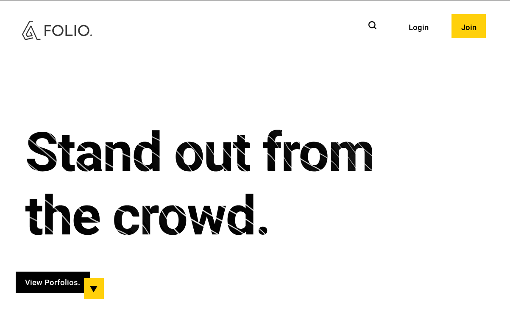
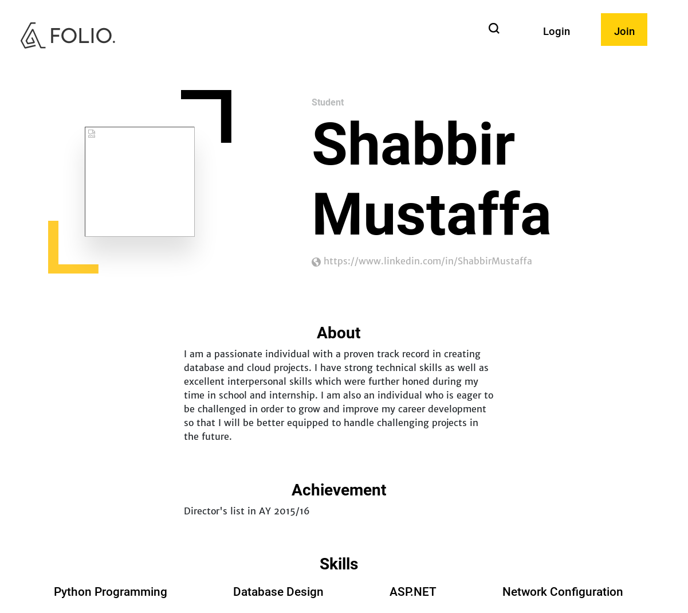

# Folio - NP Web Assignment
This repository contains our WEB assignment source code.

## Intro
Folio is a website where students can professional exhibit the portfolios for potential employers.
This project was completed as part of the WEB module's assignment.

### Screenshots
#### Homepage

#### Portfolio


## Setup 
### Docker
1. Install `docker` and `docker-compose`
2. Make a copy of the `dotenv` as `.env`and fill up the values to variables
    - reference: https://drive.google.com/file/d/1xDCzM8pVr4Fqk8lzOBl7K6GLFjE86RMT/view?usp=sharing
        3. Copy the `.env` file into `folio`, `folio_ui`, `folio_tests`,`folio_ui/Views`folders
    - if you have `make`, save the `.env` in project root and copy the files automaticaly using `make`
4. Run `docker-compose up`
5. Open the site at http://localhost:5001

### Visual Studio
1. Configure & Run SQL Server with script in `db\Student_EPortfolio_Db_SetUp_Script.sql`
2. Make a copy of the `dotenv` as `.env.`and fill up the values to variables 
    - reference: https://drive.google.com/file/d/1EuTGCEuJMSgw-6AMFpyPTtbjgTF2hyhr/view?usp=sharing
        3. Copy the `.env` file into `folio`, `folio_ui`, `folio_tests`,`folio_ui/Views`folders
4. Open `/np-web-assignment-1.sln` using the Visual Studio
5. Run the API by running the `folio` project
5. Run the UI by runing the `folio_ui` project
6. Open the site at http://localhost:5001

## Status
Current Project Status:
- 1.1 | Complete Frontend Design for Folio | :heavy_check_mark: 
- 2.1 | Complete Database setup | :heavy_check_mark: 
- 2.2 | Setup Entity Framework Core | :heavy_check_mark:
- 2.3 | Dockerize Project | :heavy_check_mark:
- 2.4.1 | AutoScaffolding of Models| :heavy_check_mark: 
- 2.4.2 | Injecting Connection String | :heavy_check_mark:
- 2.4.3 | Fixing Missing Models From Scaffolding | :heavy_check_mark:
- 2.5.1 | Setup Unit Testing Framwork| :heavy_check_mark:
- 2.5.2 | Intergration Test Models | :heavy_check_mark:
- 2.6.1 | Skillset API | :heavy_check_mark:
- 2.6.2 | CDN Service - Google Cloud | :heavy_check_mark:
- 2.6.3 | Authentication API | :heavy_check_mark:
- 2.6.4 | File API | :heavy_check_mark:
- 2.7.1 | Landing Page | :construction:
- 2.7.1 | Sign Up Page | :heavy_check_mark:
- 2.7.1 | Login Page | :heavy_check_mark:
- 2.7.1 | Student Porfolio Page | :construction:
- 2.7.1 | Student Profile page | :heavy_check_mark:
- 2.7.1 | Student View & Acknowledge Suggestion |  :heavy_check_mark:


## Design
### Project Directory Structure
- db - database setup, container
- design - frontend design
- dotenv - template for `.env` 
- folio - folio API/backend source
    - Controllers - controllers
        - API - api controllers
    - Services - utility services
        - Auth - Authentication
        - API - API support
        - Content - content delivery
- folio_ui - folio frontend source
    - Services - utility services
    - Controllers - controllers
        - view controllers
    - Views - views
    - wwwroot - static assets
        -  css - stylesheets
        -  js - javasript
        -  img - images
- folio_tests - folio project source code
- README.md - this file

### Stack
```
[Client]--[folio/api]---[DB]
   \           |
    \-----[folio]
```

- `[Client]` retrieve pages from `[folio]`
    - `[folio/ui]` retrieves data from `[folio/api]`
    - `[folio/api]` retrieves persistent data from `[DB]`
- `[Client]` performs data manpulation operations on `[folio/api]`
    - `[folio/api]` updates persistent data in `[DB]`

> Note that `[folio]` only concerns itself with the rendering of the data but
> does not handle data manuplation.

### Security
#### Authentication
**TODO: elaborate**
JWT Authorization Bearer token
